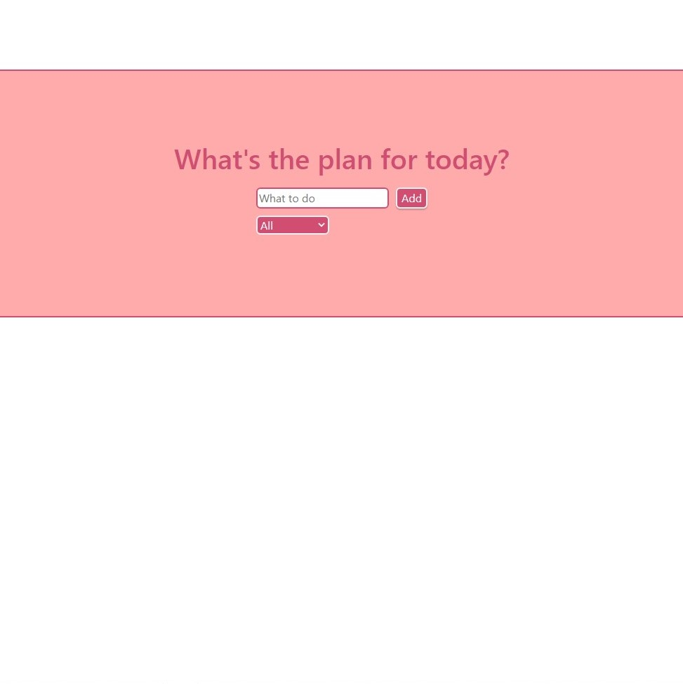
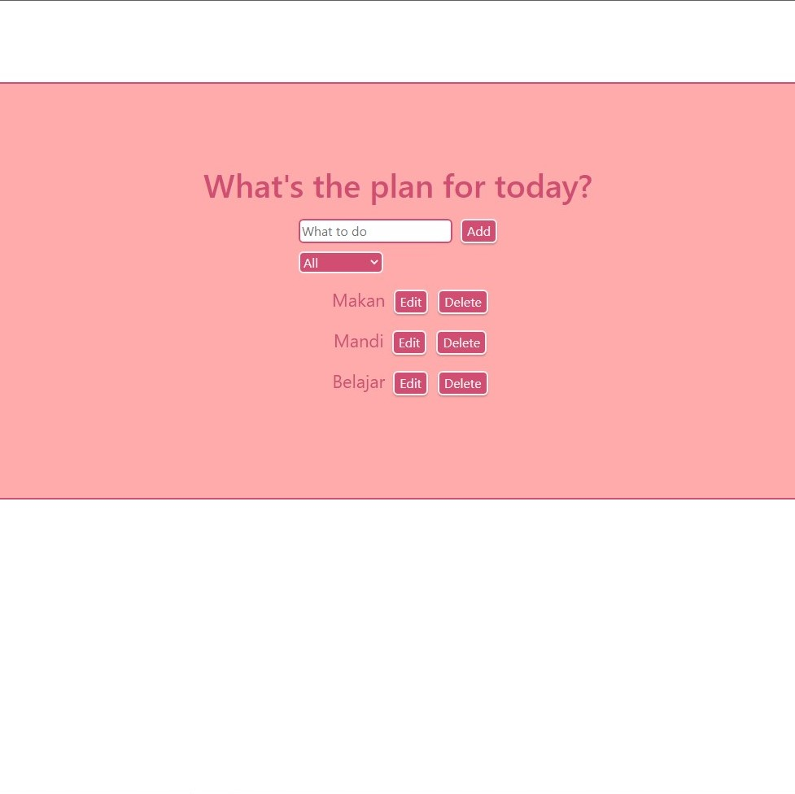
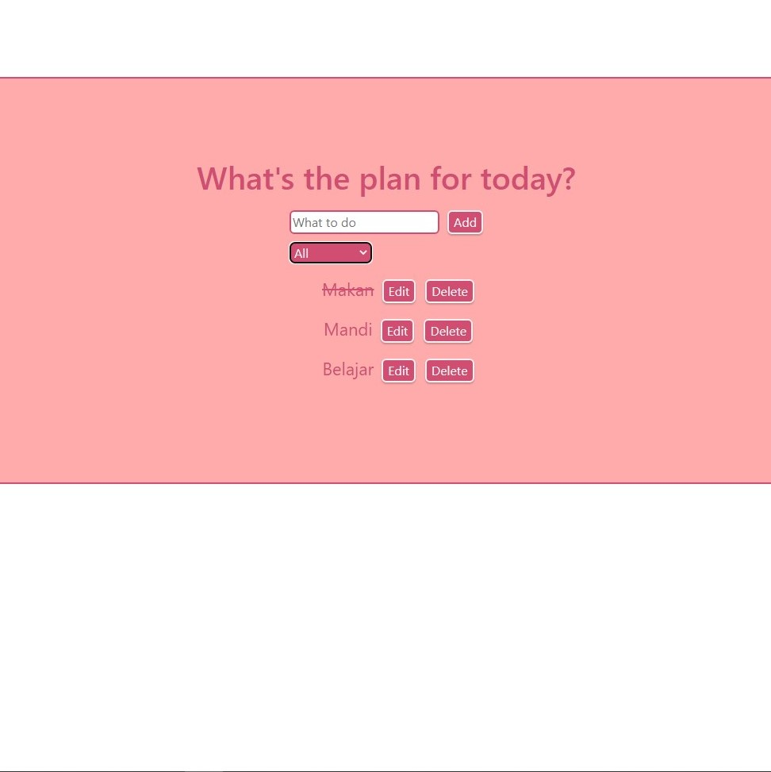
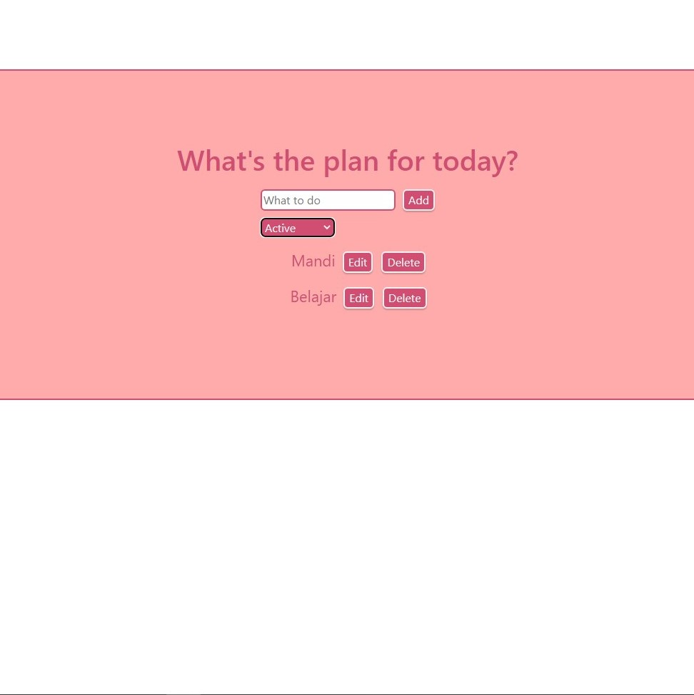

# Technical Project Assignment (TPA) #5 - Todo List App with React.js & Redux

### Specs

- Buatlah sebuah aplikasi Todo List menggunakan React.js dan state management Redux
- User dapat menambahkan 1 Todo List baru
- User dapat melihat semua Todo List (All) baik yang sedang active dan completed
- User dapat melihat/memfilter Todo List dengan status active
- User dapat melihat/memfilter Todo List dengan status completed
- User dapat menghapus Todo List
- User dapat melakukan edit Todo List

### Results

